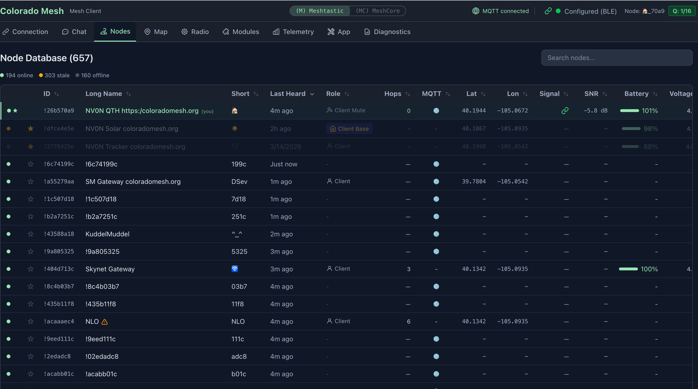
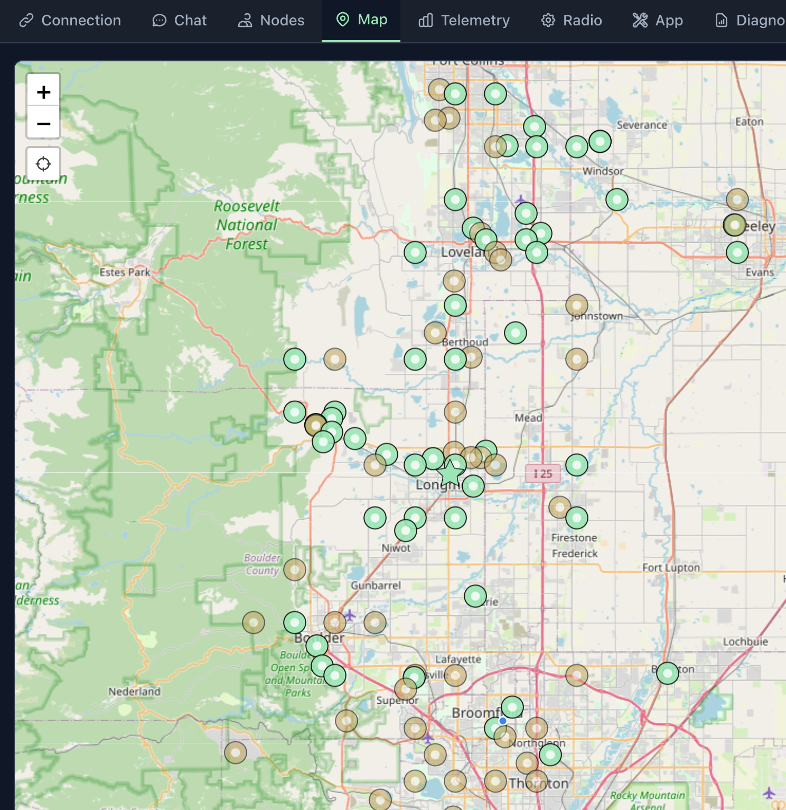
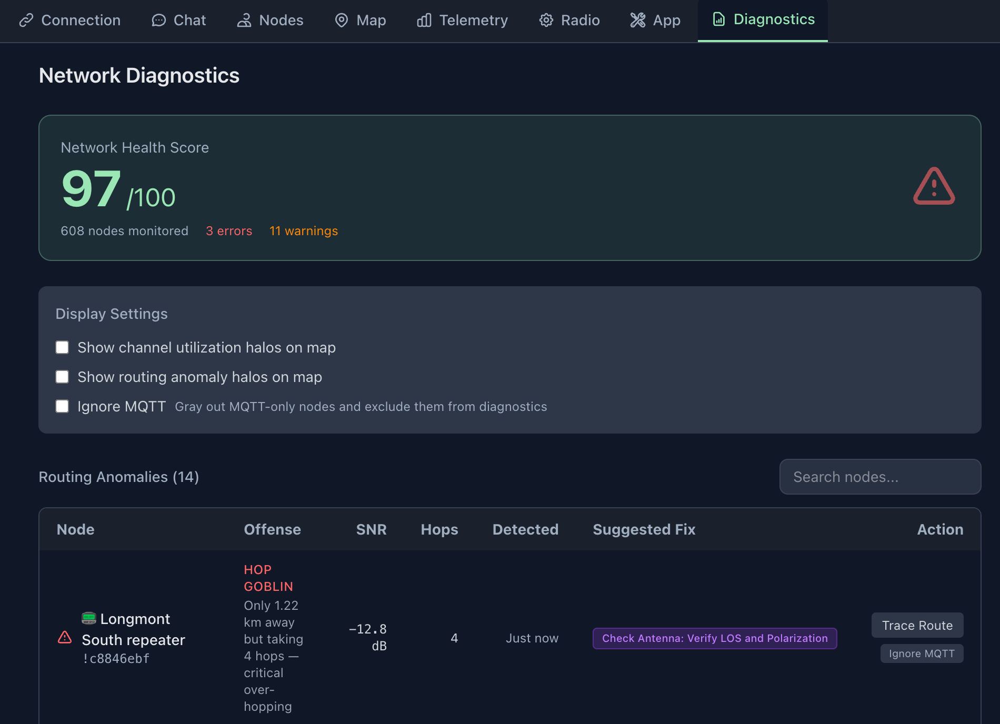
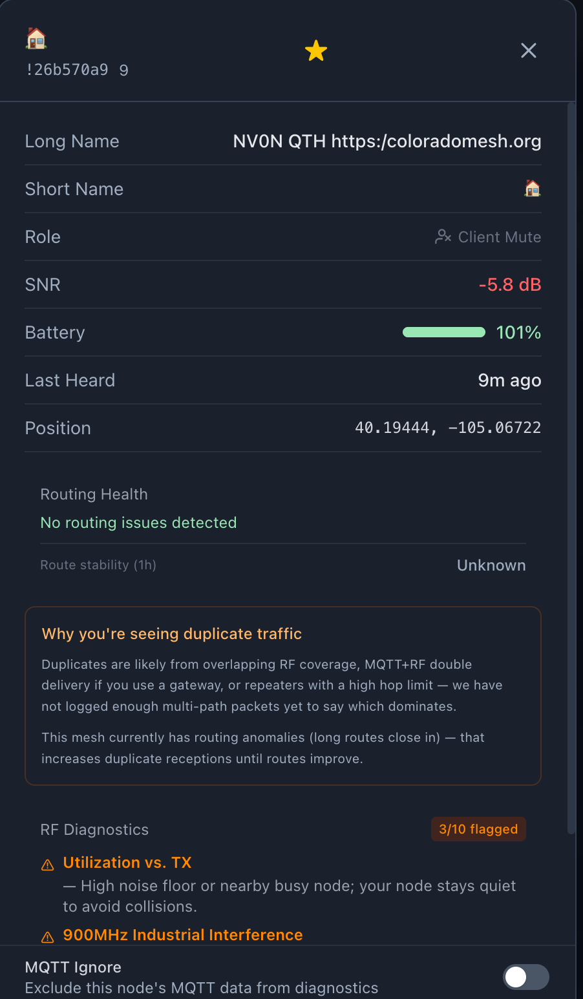
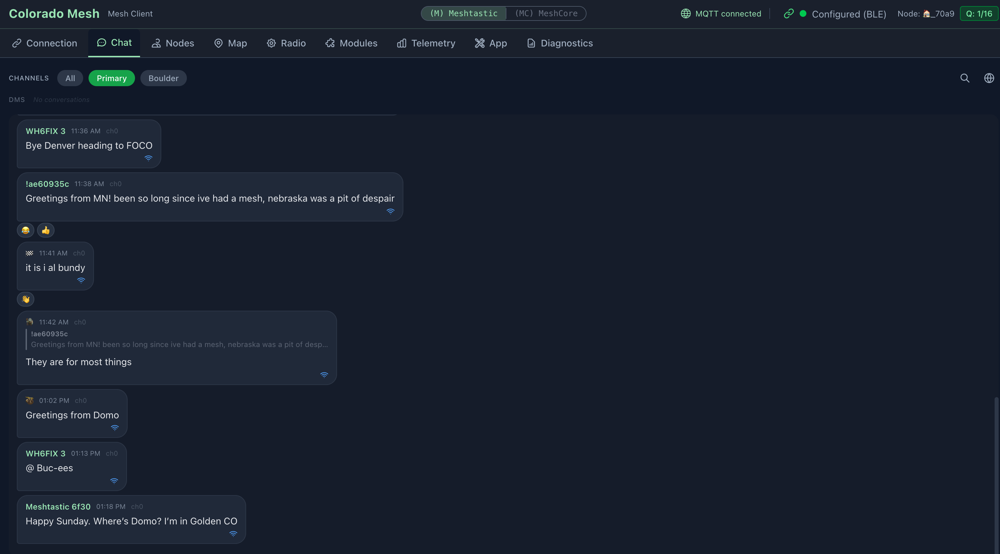
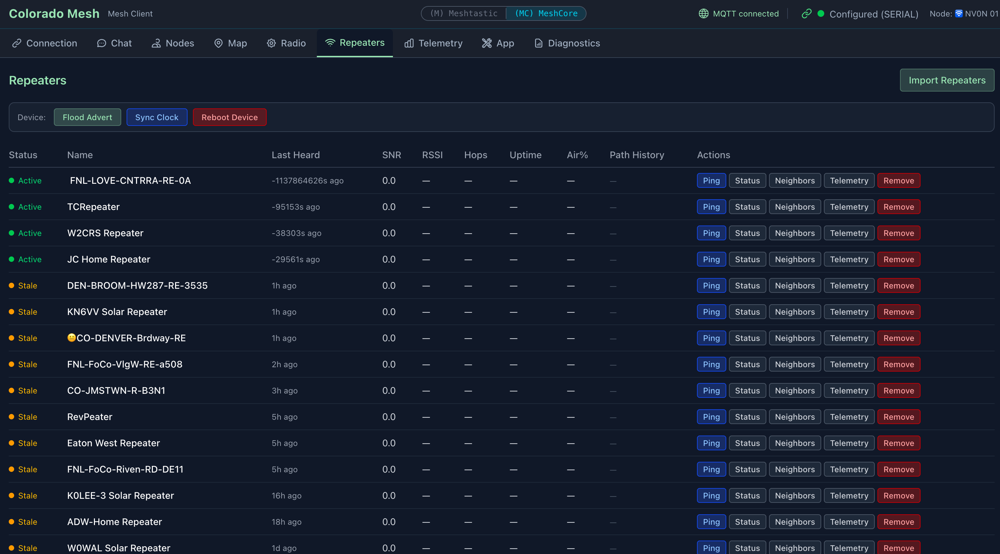

# Mesh-Client

> Cross-platform **Electron** desktop client for **Meshtastic** and **MeshCore** on **macOS**, **Linux**, and **Windows** — **BLE**, **USB serial**, **Wi‑Fi/TCP**, **MQTT**, local **SQLite** history, **routing diagnostics**, and **keyboard-first** workflows.


---

## Why

### Mesh-Client: The Universal Desktop Suite for Mesh Networks

Reliable Desktop Power. Local Persistence. Total Insight.

While official mobile apps cover the basics, desktop power users often face a fragmented ecosystem: limited app availability for MeshCore, inconsistent support across operating systems, and persistent sync issues on macOS. Mesh-Client fills those gaps with a high-performance, keyboard-driven desktop experience.

With a dedicated local SQLite database, Mesh-Client keeps message history and mesh logs durable across restarts and sync failures. It provides one reliable hub for both Meshtastic and MeshCore firmware, delivering a unified workflow regardless of protocol or hardware.

**Why Mesh-Client?**

- **True message persistence:** Local SQLite storage for reliable long-term history, without lost chats or broken logs.
- **Universal protocol support:** One consistent interface for both Meshtastic and MeshCore devices.
- **Advanced mesh visibility:** Routing diagnostics and mesh health insight that mobile apps often skip.
- **Desktop-first workflow:** Keyboard-driven navigation and MQTT integration for power users.
- **Cross-platform stability:** A feature-rich experience across macOS, Linux, and Windows.

From real-time diagnostics to permanent message archives, Mesh-Client delivers the desktop visibility serious mesh users require.

**Known Bugs:**

- **Linux BLE permissions** — BLE uses `@stoprocent/noble` (native BlueZ), which needs raw socket access. Run `sudo setcap cap_net_raw+eip $(which electron)` once after install, or launch with `sudo` during development. Packaged AppImages include the cap in the installer.

---

## Visuals

<details>
<summary>Screenshots</summary>

<table>
  <tr>
    <td></td>
    <td></td>
    <td></td>
    <td></td>
  </tr>
  <tr>
    <td colspan="4" align="center">
      
      
      
    </td>
  </tr>
</table>

</details>

---

## Key Features

### Meshtastic Features

**Radio & Channel Configuration**

- Edit channels: name, PSK, and role; 18 region presets and 7 modem presets
- Device roles: Client, Router, Tracker, Sensor, TAK, and more
- Per-channel MQTT gateway uplink (RF → MQTT); device reboot, shutdown, and factory reset

**MQTT**

- Subscribe to a broker to receive mesh traffic over the internet; AES-128-CTR decryption, automatic RF deduplication, exponential-backoff reconnect, and an **active node cache** that periodically refreshes presence information so MQTT-only and RF+MQTT nodes stay visible even when your radio is offline
- Transport indicator (RF / MQTT / both) on received messages; MQTT messages are shown in chat but not rebroadcast over RF
- Enter your broker URL, topic, and optional credentials in the MQTT section of the Connection tab; settings persist across sessions

**Module Configuration**

- Telemetry module (device, environment, air quality intervals), MQTT relay settings, Canned Messages, Serial module, Range Test, Store & Forward, Detection Sensor, and Pax Counter — all editable from the Modules tab

**Network Diagnostics**

- **Network health** — status band **Healthy / Attention / Degraded** plus error and warning counts. **Degraded** applies only when routing error count ≥ 3; fewer errors use **Attention** so small issues don't paint the whole panel red
- **Single table** from `diagnosticRows` (routing trace rows + RF rows), searchable; rows persist across sessions with an optional restore banner; **max age** (1–168 hours) trims stale routing (24 h default) and RF (1 h default) rows
- **Mesh congestion attribution** — orange banner when mesh-wide routing stress is present; duplicate-traffic block in node detail when relevant
- Routing anomaly detection: **hop_goblin** (distance-proven over-hopping), **bad_route** (high duplication), **route_flapping**, **impossible_hop** — with remediation suggestions and severity levels
- Anomaly badges inline in node list; status aura circles on the map; congestion halos toggle; global and per-node MQTT ignore
- **Environment Profile** segmented control — Standard (3 km), City (1.6× threshold), Canyon (2.6× threshold)

> See [DIAGNOSTICS.md](DIAGNOSTICS.md) for a full reference on what triggers each finding and how to interpret it.

**Environment Telemetry**

- Push-based environment charts (temperature, humidity, pressure, air quality) from Meshtastic telemetry packets, displayed in the Telemetry tab

**Packet Redundancy**

- Per-node redundancy score derived from the last 20 observed packets; `+N` echo count in the node list; collapsible Path History in node detail

---

### Features Available on Both Protocols

**Connectivity**

- **Bluetooth LE** — pair wirelessly; auto-reconnects on startup with no user gesture required (noble native BLE via BlueZ/CoreBluetooth/WinRT); last device name persists across sessions
- **USB Serial** — plug in via USB; auto-reconnects silently on startup (saved port signature matches the same physical device across re-enumeration)
- **WiFi / HTTP / TCP** — connect to network-enabled nodes; saves last address for quick reconnect
- **Dual-mode** — both Meshtastic and MeshCore run simultaneously; use the protocol switcher pill in the header to switch which view is active (the inactive protocol stays connected in the background); per-protocol unread badges (Meshtastic = green, MeshCore = cyan); passive toast notifications when the inactive protocol receives messages

**Chat**

- Send/receive messages across channels with per-transport delivery badges and delivery ACK / failure states
- **Spellcheck** — the message composer uses a textarea with inline misspelling marks; right‑click for replacements (Electron main process configures the spellchecker for **Meshtastic** and **MeshCore**)
- Emoji reactions (11 emojis with compose picker) and reply-to-message (quoted preview in bubble)
- Unread message divider that persists across restarts; auto-scrolls on tab switch
- Direct messages (DMs) to individual nodes

**Node Management**

- Node list with SNR, battery, GPS, last heard — **signal bars** appear only for direct (0-hop) RF neighbors; multi-hop and MQTT-only paths omit bars
- **Cross-Protocol Signal Analyzer** — foreign LoRa traffic detection (non-mesh packets); shown in Node Detail when present
- Distance filter, favorite/pin nodes, device role icons
- Node Detail Modal: DM, trace route with per-hop display, delete node, neighbor info

**Map & Position**

- Interactive OpenStreetMap with node positions and your current location (device GPS → browser geolocation → IP-based city-level fallback)
- **Position trail** — persisted path overlay (configurable 1 h – 7 days); survives restarts via SQLite; toggle and window size in App tab; wipe via Danger Zone
- Auto-refresh at configurable intervals; manual static position entry; send your position back to your device

**Telemetry**

- Battery voltage and signal quality charts (SNR/RSSI) in the Telemetry tab

**Productivity**

- **Log panel** (right rail) — live app log stream, optional debug toggle, export or delete the log file
- Full keyboard navigation — press `?` for shortcut reference; `Cmd/Ctrl+1–9` switches tabs; `Cmd/Ctrl+[` switches to Meshtastic; `Cmd/Ctrl+]` switches to MeshCore; `Cmd/Ctrl+Shift+F` opens **chat search** across all channels (optional `user:name` and `channel:name` filters)
- **Updates** — permanent status in the footer (up to date, update available, errors, download progress, etc.); automatic check runs a few seconds after every launch; **Check for Updates…** in the app menu (macOS) or **Help** (Windows/Linux), or tap **Up to date** in the footer to re-check; Windows/Linux packaged builds can download in-app, macOS and dev builds open the GitHub release page
- System tray with live unread badge; app stays accessible when window is closed
- Persistent SQLite storage; DB export/import/clear in the App tab; Clear GPS Data and Reset Diagnostics without a full DB wipe

**Accessibility**

- **Keyboard navigation** — every panel, form, and control is reachable by keyboard; Tab/Shift+Tab cycles interactive elements; all sortable table headers and the hop-limit slider are arrow-key operable; focus indicator is always visible
- **Modal focus trap** — Tab cycles only within an open modal or dialog; Escape closes and returns focus to the triggering control
- **Screen reader support** — connection status changes announced via `aria-live`; modals and dialogs carry `role="dialog"` / `role="alertdialog"` with `aria-labelledby`; form errors announced immediately via `role="alert"`; sortable columns expose `aria-sort`; toggle buttons expose `aria-pressed`; icon-only controls have `aria-label`; status indicators pair color with a text alternative so they are not color-only
- **Reduced motion** — `@media (prefers-reduced-motion: reduce)` suppresses pulse animations, halo rings, and transition effects
- **Windows High Contrast** — `@media (forced-colors: active)` support prevents Tailwind from overriding system colors
- **Automated tests** — vitest-axe accessibility assertions run on every major panel as part of the pre-commit test suite

---

### MeshCore Features

MeshCore runs simultaneously alongside Meshtastic. Use the protocol switcher pill in the header to bring MeshCore into view — the Meshtastic session stays connected in the background. When viewing MeshCore, the sixth tab is **Repeaters** (instead of Modules); all other tabs, including Network Diagnostics, are available.

**Contacts & Discovery**

- Contact list with advert-based positions, contact types (Chat, Repeater, Room), and GPS coordinates persisted to SQLite; contacts seed from DB on reconnect as a fallback cache
- **Favorite / pin** — persisted per contact in SQLite (`meshcore_contacts.favorited`)
- **Refresh Contacts** — pull the full contact list from the device on demand
- **Send Advert** — broadcast your node's presence (flood advert) to the mesh
- **Manual Contact Approval** — toggle between auto-add (contacts appear automatically when heard) and manual-add (new contacts require approval before appearing); preference is persisted and re-applied on reconnect

**Messaging**

- Channel messaging and **direct messages (DMs)** with delivery ACK tracking (`expectedAckCrc`) and failure timeout
- **Transport badges** on received messages — **RF**, **MQTT**, or **both** (persisted as `received_via` in `meshcore_messages`); MQTT JSON chat can be used when RF is down
- Incoming push events: periodic advert (0x80), path update (0x81), send confirmed (0x82), message waiting (0x83), new contact (0x8A), incoming DM (7), incoming channel message (8)
- All messages and contacts persisted to SQLite (`meshcore_messages`, `meshcore_contacts` tables)

**Diagnostics & Remote Queries**

- **Trace route** (`tracePath`) — per-hop SNR display; each intermediate hop's SNR is reported individually, unlike Meshtastic's hop-count-only trace
- **Repeater Status** — on-demand query of noise floor, last RSSI/SNR, packet counts, air time, uptime, TX queue, error events, and duplicate counts; available for any contact
- **Remote Telemetry** — pull CayenneLPP-encoded environment data (temperature, humidity, barometric pressure, voltage, GPS) from any contact via `getTelemetry`; results shown inline in the node detail modal with fetch timestamp
- **Neighbor Info** — query a Repeater node's neighbor list via `getNeighbours`; shows each neighbor's name (resolved from contacts or hex prefix), how recently it was heard, and color-coded SNR

**Repeaters**

- **Repeaters panel** (MeshCore-only tab) — list repeaters with on-demand status (noise floor, RSSI/SNR, packet counts, air time, uptime, TX queue); JSON nickname import for bulk contact names; **Path** column shows a per-hop SNR sparkline from the last trace; per-row **Neighbors** expands an inline neighbor list (same query as node detail)
- **Panel toolbar** — **Send Advert**, **Sync Clock**, and **Reboot Device** (shown when the device supports the corresponding commands)
- **Per-repeater removal** — two-click confirm button on each row; removes from in-memory state and deletes from the SQLite contacts DB
- **Clear All Repeaters** — Danger Zone entry in the App tab that deletes all Repeater-type contacts (contact_type = 2) from the DB while leaving Chat and Room contacts intact

**Radio Parameters**

- Frequency (Hz), bandwidth, spreading factor, coding rate, and TX power — synced from device `selfInfo` and applied live via the Radio tab
- **Channel display and edit** — view and edit channel list from the device in the Radio tab; **Import Config JSON** (MeshCore) applies name and radio settings to the device and reports what was applied vs. not supported

**Battery & Signal Telemetry**

- Battery voltage from device `selfInfo`; per-packet signal telemetry (SNR/RSSI) from RF event 0x88 — visible in the Telemetry tab
- **Environment charts** (temperature, humidity, barometric pressure, etc.) in the Telemetry tab when pulled Cayenne LPP data is available — same panel as Meshtastic environment telemetry

**Transport Notes**

- BLE: waits for GATT init (`connected` event) before issuing commands; includes nudge timeout for stuck `deviceQuery` on some devices
- Serial: auto-reconnects on startup using a saved port signature so reconnect targets the same physical device when possible
- TCP: connects to MeshCore companion radio on port 4403
- **MQTT (JSON v1):** The Connection tab MQTT card includes **Network Preset** buttons — **LetsMesh** (WebSocket on port 443, topic prefix `meshcore`; broker auth uses `@michaelhart/meshcore-decoder`’s `createAuthToken` — MQTT username `v1_<64-hex public key>`, password token with JWT `aud` matching the **MQTT server hostname** (e.g. `mqtt-us-v1.letsmesh.net` for the US preset); optional **Packet logger (Analyzer)** forwards RX packet summaries to the broker when enabled; see [docs/letsmesh-mqtt-auth.md](docs/letsmesh-mqtt-auth.md)), **Ripple Networks** (TLS on port 8883, same topic prefix, preset default credentials, and **Allow insecure TLS** for brokers that use a non–public CA), and **Custom** for your own broker

---

## Limitations

- **MQTT → RF**: Messages received via MQTT are shown in chat but are not rebroadcast over the radio. Previous relay behavior caused duplicate or misattributed messages.
- **MeshCore — MQTT (JSON v1)**: The Connection tab can connect to an MQTT broker in MeshCore mode using a small JSON chat envelope (see [docs/meshcore-meshtastic-parity.md](docs/meshcore-meshtastic-parity.md)). This is separate from Meshtastic’s protobuf MQTT pipeline.
- **MeshCore — no routing anomaly diagnostics**: Hop anomaly detection (hop_goblin, bad_route, etc.) and RF diagnostics require Meshtastic-specific packets (`hops_away`, LocalStats, NeighborInfo). The Network Diagnostics tab is available in MeshCore for foreign LoRa detection and other shared features.
- **MeshCore — no channel/device config editing**: MeshCore does not expose a channel-configuration API. Radio parameters (frequency, bandwidth, spreading factor, coding rate, TX power) can be set via the Radio tab.
- **MeshCore — remote telemetry availability**: `getTelemetry` requires the remote node to have environment sensors. A timeout is returned if the node has no sensor data.
- **MeshCore — neighbor info availability**: `getNeighbours` is supported only by Repeater-type nodes running firmware v1.9.0+. The button is hidden for Chat and Room contacts.
- **MeshCore — contact type labels**: MeshCore reports a numeric `type` field (0 = None, 1 = Chat, 2 = Repeater, 3 = Room); displayed in the hw_model field in the node list.
- **Map tiles — OpenStreetMap Referer requirement**: Packaged desktop builds load the UI from the local filesystem. The main process now loads the renderer with an explicit HTTP referrer so OpenStreetMap tile requests include a valid `Referer` header and comply with the [tile usage policy](https://operations.osmfoundation.org/policies/tiles/). If you point the app at a different tile server, ensure its usage policy permits this client.

---

## Quick Start

**Pre-built binaries** for **macOS**, **Linux**, and **Windows** are available in the [GitHub Releases](https://github.com/Colorado-Mesh/mesh-client/releases) area. Download the installer or archive for your platform — no Node.js or build tools required.

**macOS (release download):** If macOS reports **“Mesh-client” is damaged and can’t be opened** (or **File is damaged and cannot be opened**), that is usually **Gatekeeper quarantine** on downloaded, **unsigned** apps — especially on **Apple silicon (M-series)** Macs — not a corrupt file. Remove the quarantine attribute, then open the app again (use the path where your copy actually lives):

```bash
xattr -r -d com.apple.quarantine /Applications/Mesh-client.app
```

See [Troubleshooting — macOS: File is damaged…](#macos-file-is-damaged-and-cannot-be-opened) and [this explanation for a similar Electron app](https://github.com/jeffvli/feishin/issues/104#issuecomment-1553914730).

**To build from source**, you need:

- **Node.js** 22.12.0+ (matches `@electron/rebuild` / `node-abi`) and **npm** 9+
- **Native build tools** (for SQLite) — see platform notes below
- A **Meshtastic** or **MeshCore** device

### Mac & Linux

```bash
git clone https://github.com/Colorado-Mesh/mesh-client
cd mesh-client
npm install
npm start
```

<details>
<summary>Mac — extra notes</summary>

Install Xcode Command Line Tools if `npm install` fails:

```bash
xcode-select --install
```

On first Bluetooth connection, macOS shows a system popup requesting Bluetooth permission — you must accept. If you accidentally denied it, go to **System Settings > Privacy & Security > Bluetooth** and toggle Mesh-Client on.

</details>

<details>
<summary>Linux — extra notes</summary>

Install Node.js (22.12.0+ recommended) and build tools:

```bash
# Debian/Ubuntu — install nvm, then Node 22 LTS:
curl -fsSL https://raw.githubusercontent.com/nvm-sh/nvm/v0.40.0/install.sh | bash
export NVM_DIR="$HOME/.nvm"
[ -s "$NVM_DIR/nvm.sh" ] && . "$NVM_DIR/nvm.sh"
nvm install 22

# Build tools for native modules:
sudo apt install build-essential python3

# Fedora/RedHat — Node 22 via nvm, then dev tools:
curl -fsSL https://raw.githubusercontent.com/nvm-sh/nvm/v0.40.0/install.sh | bash
export NVM_DIR="$HOME/.nvm"
[ -s "$NVM_DIR/nvm.sh" ] && . "$NVM_DIR/nvm.sh"
nvm install 22
sudo dnf groupinstall "Development Tools" && sudo dnf install python3
```

**Building distributables:**

On Debian/Ubuntu, to also build `.rpm` packages you need the `rpm` package:

```bash
sudo apt install rpm
```

On Fedora/RedHat, building `.deb` packages is not easily supported. Use these targets instead:

```bash
npm run dist:linux -- --linux rpm
npm run dist:linux -- --linux appimage
```

BLE uses `@stoprocent/noble` (native BlueZ) and requires raw socket capability:

```bash
sudo setcap cap_net_raw+eip $(which electron)
```

Run this once after `npm install`. You may alternatively run with `sudo` during development. BlueZ is the standard Linux Bluetooth stack and is included in most distros.

**Sandbox issues (dev mode or AppImage):**

Some Linux configurations require disabling Electron's sandbox. If the app fails to launch, try:

```bash
npm run dev -- --no-sandbox        # dev mode
./MeshClient.AppImage --no-sandbox # AppImage
```

For serial access, add yourself to the `dialout` group (then log out and back in):

```bash
sudo usermod -a -G dialout $USER
```

**ARM architecture (Raspberry Pi, etc.) — additional requirements:**

Install these extra libraries before running in development mode:

```bash
sudo apt install zlib1g-dev libfuse2
```

Electron's sandbox requires elevated privileges on ARM. Either grant sandbox permissions:

```bash
sudo sysctl -w kernel.unprivileged_userns_clone=1
```

Or launch with the no-sandbox flag:

```bash
npm run dev -- --no-sandbox
# or
electron . --no-sandbox
```

**SIGILL during `npm install`** (`electron exited with signal SIGILL`):

`postinstall` runs `scripts/rebuild-native.mjs`, which invokes electron-builder's `install-app-deps` — that **executes** the Electron binary. Sandboxed or minimal-CPU environments may not support instructions in the prebuilt Linux binary, so the process dies with SIGILL before the app starts (this is not the same as Chromium's `--no-sandbox` runtime flag).

If you see `npm WARN EBADENGINE` for `@electron/rebuild` or `node-abi` (for example `required: { node: '>=22.12.0' }` while your current Node is older), install Node 22+ first (for example via nvm as shown above). Running with an older Node version may appear to work but is unsupported by those tools and more likely to fail during native rebuilds.

```bash
# Install without running Electron / native rebuild; patch-package still runs.
MESHTASTIC_SKIP_ELECTRON_REBUILD=1 npm install
```

Then run **`npm run rebuild`** on a normal Linux machine (or same host outside the sandbox) where `node_modules/electron/dist/electron --version` works. Lint/tests that do not load the Electron main process may still pass without a successful rebuild.

**SIGSEGV on startup** (`electron exited with signal SIGSEGV`):

`npm start` runs `npm run build && electron .` — extra args after `npm start --` are **not** passed to Electron. Use one of:

```bash
npm run build && npx electron . --no-sandbox --disable-gpu
# or (after build once)
npm run electron:open -- --no-sandbox --disable-gpu
```

If that works, make it persistent:

- **Shell:** `export MESH_CLIENT_DISABLE_GPU=1` then `npm start` (main process disables GPU before windows open).
- **Wayland → X11:** `ELECTRON_OZONE_PLATFORM_HINT=x11 npm run electron:open -- --no-sandbox`
- **Packaged AppImage:** `./MeshClient.AppImage --no-sandbox --disable-gpu`

See [electron#41980](https://github.com/electron/electron/issues/41980) and related GPU/Wayland issues.

</details>

<a id="windows--extra-notes"></a>

<details>
<summary>Windows — extra notes</summary>

**1. Install prerequisites** (if not already):

```powershell
winget install git.git
winget install openjs.nodejs
```

**2. Allow npm scripts:**

```powershell
Set-ExecutionPolicy -ExecutionPolicy RemoteSigned -Scope CurrentUser
```

**3. Install [Visual Studio Build Tools](https://visualstudio.microsoft.com/visual-cpp-build-tools/)** with the "Desktop development with C++" workload (required for native SQLite and Serial).

**4. Install Python 3** — node-gyp (used to build native modules including `@serialport/bindings-cpp` and `@stoprocent/noble`) requires Python on Windows. Install from [python.org](https://www.python.org/downloads/) or `winget install Python.Python.3.12`, and during setup check **"Add Python to PATH"**. If Python is installed but not found, set it explicitly: `npm config set python "C:\Path\To\python.exe"`.

**5. Clone and run:**

```bash
git clone https://github.com/Colorado-Mesh/mesh-client
cd mesh-client
npm install
npm start
```

If serial isn't detected, install the correct USB drivers for your device (CP210x or CH340).

</details>

---

## Usage

### Choosing a Protocol

Both protocols run at the same time. Use the **Meshtastic / MeshCore** switcher pill in the header to bring the desired protocol's view into focus — the other session remains connected in the background. Each protocol stores its own last-connection and auto-reconnects independently on startup.

### Connecting Your Device

**Meshtastic:**

1. Power on your Meshtastic device
2. Put it in Bluetooth pairing mode (if connecting via BLE)
3. Open Mesh-Client and go to the **Connection** tab, ensure **Meshtastic** is selected
4. Select your connection type (Bluetooth / USB Serial / WiFi / MQTT)
5. Click **Connect** and select your device from the picker
6. Wait for status to show **Configured** — you're connected

**MeshCore:**

1. Power on your MeshCore firmware device
2. In the Connection tab, select **MeshCore**
3. Choose **Bluetooth**, **Serial**, or **TCP** (enter the device's IP address for TCP)
4. Click **Connect** — the app fetches self info, contacts, and channels from the device
5. Wait for status to show **Configured** — contacts and channels are loaded

### Auto-Reconnect

After a successful connection, Mesh-Client remembers your last device per protocol. On next launch:

- **Serial** — auto-connects silently in the background (both protocols)
- **Bluetooth** — auto-scans on launch and reconnects when the last device is discovered (no user gesture required)
- **WiFi / TCP** — a one-click reconnect card appears; click **Reconnect**
- **MQTT** — auto-reconnects using saved broker settings (Meshtastic protobuf pipeline; MeshCore JSON v1 adapter — select transport when connecting)

### MQTT

Enter your broker URL, topic, and optional credentials in the MQTT section of the Connection tab. When connected, the section collapses to a compact info card showing the server, client ID, and topic. You can send messages via MQTT without a radio when using **Meshtastic**, or **MeshCore** with brokers other than the public **LetsMesh** presets (Ripple / Custom still use the JSON v1 chat envelope for MQTT-only sends). **LetsMesh** public MQTT targets the **Analyzer** packet-logger model: optional RX summaries to `{topicPrefix}/meshcore/packets` when your radio is connected ([docs/letsmesh-mqtt-auth.md](docs/letsmesh-mqtt-auth.md)); MQTT-only channel chat to LetsMesh without a radio is not supported. **Meshtastic** uses the protobuf MQTT stack; **MeshCore** broker details are in [docs/meshcore-meshtastic-parity.md](docs/meshcore-meshtastic-parity.md). In **MeshCore** mode, **LetsMesh** / **Ripple Networks** presets fill those fields for the corresponding public networks. **LetsMesh** uses the same contract as [meshcore-mqtt-broker](https://github.com/michaelhart/meshcore-mqtt-broker) with JWT `aud` matching the **regional broker hostname** you connect to (e.g. `mqtt-us-v1.letsmesh.net` / `mqtt-eu-v1.letsmesh.net`); mesh-client generates tokens from your imported MeshCore identity (`public_key` + `private_key` in config JSON). Use **Custom** and paste credentials manually if your operator issued different rules.

---

## Configuration

### Connection Types

**Meshtastic** supports all four transport types:

| Platform | Bluetooth | Serial | HTTP | MQTT |
| -------- | --------- | ------ | ---- | ---- |
| macOS    | Yes       | Yes    | Yes  | Yes  |
| Windows  | Yes       | Yes    | Yes  | Yes  |
| Linux    | Yes       | Yes    | Yes  | Yes  |

**MeshCore** supports BLE, Web Serial, TCP, and optional MQTT (broker JSON v1 adapter):

| Platform | Bluetooth | Serial | TCP | MQTT (JSON v1) |
| -------- | --------- | ------ | --- | -------------- |
| macOS    | Yes       | Yes    | Yes | Yes            |
| Windows  | Yes       | Yes    | Yes | Yes            |
| Linux    | Yes       | Yes    | Yes | Yes            |

### Tech Stack

| Component  | Technology                                                                               |
| ---------- | ---------------------------------------------------------------------------------------- |
| Desktop    | Electron                                                                                 |
| UI         | React 19 + TypeScript                                                                    |
| Styling    | Tailwind CSS v4                                                                          |
| Meshtastic | @meshtastic/core + transport-http, transport-web-serial (JSR); BLE via @stoprocent/noble |
| MeshCore   | @liamcottle/meshcore.js (BLE, Web Serial, TCP via main-process IPC)                      |
| Maps       | Leaflet + OpenStreetMap                                                                  |
| Charts     | Recharts                                                                                 |
| Database   | SQLite (node:sqlite built-in, via db-compat.ts shim)                                     |
| Build      | esbuild + Vite + electron-builder                                                        |

### Project Structure

```
mesh-client/
├── .github/
│   ├── workflows/                # CI and release (ci.yaml, release.yaml, tests.yaml)
│   ├── ISSUE_TEMPLATE/           # Bug report and feature request templates
│   ├── codeql/                   # CodeQL config
│   └── dependabot.yml
├── src/
│   ├── main/
│   │   ├── index.ts              # Window creation, BLE/Serial intercept, IPC (incl. meshcore TCP & MQTT)
│   │   ├── noble-ble-manager.ts  # BLE via @stoprocent/noble (BlueZ); scan/connect IPC
│   │   ├── meshcore-mqtt-adapter.ts  # MeshCore MQTT JSON v1 subscribe/publish
│   │   ├── log-service.ts        # Log file, console patch, log panel IPC
│   │   ├── sanitize-log-message.ts  # Log injection sanitization (CodeQL); use at call sites before appendLine
│   │   ├── database.ts           # SQLite schema & migrations (WAL mode)
│   │   ├── db-compat.ts          # better-sqlite3 API shim over node:sqlite (no node-gyp)
│   │   ├── mqtt-manager.ts       # MQTT client: AES decrypt, dedup, protobuf decode (Meshtastic only)
│   │   ├── updater.ts            # Auto-update checks via electron-updater
│   │   └── gps.ts                # Main-process GPS helper
│   ├── preload/
│   │   └── index.ts              # contextBridge: electronAPI (db, mqtt, log, BLE, serial, session, meshcore.tcp)
│   ├── shared/
│   │   ├── electron-api.types.ts     # IPC / preload API contracts
│   │   ├── meshcoreMqttEnvelope.ts   # JSON v1 envelope parse/validate (main + renderer)
│   │   ├── nodeNameUtils.ts          # Shared node naming helpers
│   │   ├── sqlLikeEscape.ts          # SQL LIKE escape for safe queries
│   │   └── withTimeout.ts            # Shared timeout helper
│   └── renderer/
│       ├── index.html            # HTML entry
│       ├── main.tsx              # React entry point
│       ├── App.tsx               # Shell: 9 tabs (protocol-dependent: Modules vs Repeaters), Log panel, shortcuts, status
│       ├── styles.css            # Global styles, theme variables
│       ├── components/           # Panels and UI (many have co-located *.test.tsx)
│       │   ├── ChatPanel.tsx         # Chat UI, DMs, emoji reactions, channel switching
│       │   ├── SearchModal.tsx       # Cross-channel chat search (`user:` / `channel:` filters)
│       │   ├── NodeListPanel.tsx     # Node browser with online/stale/offline/MQTT filter
│       │   ├── MapPanel.tsx          # Node positions on OpenStreetMap (Leaflet)
│       │   ├── TelemetryPanel.tsx    # Battery/voltage/SNR charts (Recharts)
│       │   ├── ConfigPanel.tsx       # Meshtastic: device & channel configuration editor
│       │   ├── ModulePanel.tsx       # Meshtastic: modules tab (telemetry, MQTT, etc.)
│       │   ├── ConnectionPanel.tsx   # BLE/Serial/HTTP/MQTT; protocol toggle; MeshCore manual contact toggle
│       │   ├── DiagnosticsPanel.tsx  # Health band + counts, diagnosticRows table, halos, max age
│       │   ├── MeshCongestionAttributionBlock.tsx  # Shared mesh congestion / duplicate-traffic copy
│       │   ├── LogPanel.tsx          # Live app log, debug toggle, export/delete log file
│       │   ├── RadioPanel.tsx        # Radio settings, position, GPS send; MeshCore: channels, Import Config JSON
│       │   ├── RepeatersPanel.tsx    # MeshCore: repeater list, status, trace SNR, neighbors, console actions
│       │   ├── AppPanel.tsx          # App settings, theme presets, GPS interval, database management
│       │   ├── NodeDetailModal.tsx   # Node info overlay; MeshCore: trace, repeater status, telemetry, neighbors
│       │   ├── NodeInfoBody.tsx      # Shared node info content (modal + map popup)
│       │   ├── KeyboardShortcutsModal.tsx
│       │   ├── UpdateStatusIndicator.tsx # Footer update status
│       │   ├── ErrorBoundary.tsx     # Top-level React error boundary
│       │   ├── SignalBars.tsx        # Signal strength → bars for direct (0-hop) RF only
│       │   ├── RefreshButton.tsx
│       │   ├── Toast.tsx
│       │   └── Tabs.tsx
│       ├── hooks/
│       │   ├── useDevice.ts          # Meshtastic: device lifecycle, 3 transports, auto-reconnect
│       │   └── useMeshCore.ts        # MeshCore: BLE/Serial/TCP/MQTT, contacts, messages, ACK, trace, telemetry
│       ├── stores/
│       │   ├── diagnosticsStore.ts   # Anomalies, halo flags, MQTT ignore, foreign LoRa (both protocols)
│       │   ├── mapViewportStore.ts   # Persisted map center/zoom
│       │   ├── positionHistoryStore.ts  # Persisted position trail (1h–7d window, SQLite-backed); path overlay visibility
│       │   └── repeaterSignalStore.ts    # MeshCore: repeater status cache
│       ├── lib/
│       │   ├── types.ts              # MeshNode, ChatMessage, DeviceState, MeshProtocol, etc.
│       │   ├── connection.ts         # Meshtastic: createConnection (BLE/Serial/HTTP)
│       │   ├── serialPortSignature.ts    # Serial port identity persistence for gesture-free reconnect (shared)
│       │   ├── foreignLoraDetection.ts   # Cross-protocol: classify payload, foreign LoRa, RSSI/SNR
│       │   ├── meshcoreUtils.ts      # MeshCore: pubkeyToNodeId, meshcoreContactToMeshNode, contact types
│       │   ├── gpsSource.ts          # GPS waterfall: device → geolocation → null
│       │   ├── nodeStatus.ts         # Node freshness: online <2 h, stale 2–72 h, offline 72 h+
│       │   ├── coordUtils.ts         # Coordinate conversion helpers
│       │   ├── reactions.ts          # Emoji reaction helpers
│       │   ├── roleInfo.tsx          # Node role display metadata
│       │   ├── signal.ts             # Signal strength → level for SignalBars (direct RF only)
│       │   ├── themeColors.ts        # Theme color helpers
│       │   ├── parseStoredJson.ts    # Safe JSON parse for persisted values
│       │   ├── radio/
│       │   │   ├── BaseRadioProvider.ts  # ProtocolCapabilities; MESHTASTIC_CAPABILITIES, MESHCORE_CAPABILITIES
│       │   │   └── providerFactory.ts    # useRadioProvider(protocol) — memoized capabilities
│       │   ├── transport/             # Meshtastic: transport abstraction (used by connection.ts)
│       │   │   ├── TransportManager.ts
│       │   │   └── types.ts
│       │   └── diagnostics/
│       │       ├── RoutingDiagnosticEngine.ts  # Hop anomalies (Meshtastic); protocol-aware
│       │       ├── RFDiagnosticEngine.ts       # RF-layer signal diagnostics
│       │       ├── diagnosticRows.ts           # Row merge/prune, default ages
│       │       ├── meshCongestionAttribution.ts # Path mix + RF originator for congestion copy
│       │       ├── snrMeaningfulForNodeDiagnostics.ts
│       │       └── RemediationEngine.ts        # Suggested fixes for routing + RF rows
│       ├── types/                  # Type declarations (web-serial.d.ts, meshcore.d.ts)
│       └── workers/
│           └── messageEncoder.worker.ts  # Meshtastic: message encoding worker
├── resources/
│   ├── icons/                    # App icons (linux/, mac/, win/)
│   ├── entitlements.mac.plist    # macOS signing entitlements (main)
│   └── entitlements.mac.inherit.plist  # macOS child-process entitlements
├── scripts/
│   ├── rebuild-native.mjs        # Rebuilds @stoprocent/noble for Electron ABI (postinstall)
│   ├── wait-for-dev.mjs          # Waits for Vite dev server before launching Electron
│   ├── check-log-injection.mjs   # Pre-commit: log call sites use sanitizeLogMessage (CodeQL)
│   ├── check-db-migrations.mjs   # Pre-commit: migration / schema consistency
│   ├── check-ipc-contract.mjs    # Pre-commit: preload and main API alignment
│   ├── check-log-panel-filter.mjs
│   ├── check-console-log.mjs
│   ├── check-silent-catches.mjs
│   ├── check-xss-patterns.mjs
│   └── letsmesh-mqtt-probe.mjs   # Optional LetsMesh / MQTT debugging
├── patches/                     # patch-package patches (e.g. electron-builder)
├── docs/
│   ├── accessibility-checklist.md
│   ├── letsmesh-mqtt-auth.md    # LetsMesh broker auth and analyzer-related notes
│   ├── meshcore-meshtastic-parity.md  # Meshtastic vs MeshCore feature parity
│   └── images/                  # README screenshots (nodes, map, diagnostics, node-detail, chat, connection, repeaters)
├── release.sh                   # Release automation script
├── electron-builder.yml         # Distributable config (targets, icons, signing)
├── vite.config.ts               # Renderer build (Vite)
├── vitest.config.ts             # Test runner config
├── tsconfig.json                # Base TypeScript config (renderer)
├── tsconfig.main.json           # TypeScript config for main/preload
├── eslint.config.mjs
├── postcss.config.cjs
└── package.json
```

**Where diagnostics UI lives in code**

- **Node detail** (modal when you open a node): shell is [`src/renderer/components/NodeDetailModal.tsx`](src/renderer/components/NodeDetailModal.tsx); body content and RF findings list are [`src/renderer/components/NodeInfoBody.tsx`](src/renderer/components/NodeInfoBody.tsx) (`RFDiagnosticsSection`, mesh congestion / duplicate-traffic block, Connection Health / Path History when redundant paths exist). Modal body is scrollable (max height); position/trace/message actions are omitted for the home node.
- **Network diagnostics tab**: [`src/renderer/components/DiagnosticsPanel.tsx`](src/renderer/components/DiagnosticsPanel.tsx) (health band + counts, diagnosticRows table, mesh congestion banner, env profile, halo toggles, diagnostic row max age).
- **Mesh congestion UI**: [`src/renderer/components/MeshCongestionAttributionBlock.tsx`](src/renderer/components/MeshCongestionAttributionBlock.tsx) (shared between panel and node detail).
- **Engines**: RF findings [`src/renderer/lib/diagnostics/RFDiagnosticEngine.ts`](src/renderer/lib/diagnostics/RFDiagnosticEngine.ts); routing anomalies [`src/renderer/lib/diagnostics/RoutingDiagnosticEngine.ts`](src/renderer/lib/diagnostics/RoutingDiagnosticEngine.ts); row merge/prune [`src/renderer/lib/diagnostics/diagnosticRows.ts`](src/renderer/lib/diagnostics/diagnosticRows.ts); store [`src/renderer/stores/diagnosticsStore.ts`](src/renderer/stores/diagnosticsStore.ts).

### Diagnostics Reference

For a detailed explanation of every diagnostic output — routing anomalies, RF findings, packet redundancy scores, map halos, and MQTT filtering — see [DIAGNOSTICS.md](DIAGNOSTICS.md).

---

## Building a Distributable

```bash
npm run dist:mac      # macOS → .dmg + .zip in release/
npm run dist:linux    # Linux → .AppImage + .deb in release/
npm run dist:win      # Windows → .exe installer in release/
```

Output goes to the `release/` directory.

---

## Contributing / Development

To run in development mode with hot reload:

```bash
npm run dev
```

This starts the Vite dev server, watches main/preload for changes, and launches Electron automatically. For the best experience, install [React DevTools](https://react.dev/link/react-devtools).

CI (GitHub Actions) runs on **Node 22** for build, test, and release jobs. Use Node 22 locally to match CI and avoid Linux-specific issues on older Node versions. To run workflows locally, use [act](https://github.com/nektos/act) with the amd64 image so Linux jobs match the runner environment:

```bash
act --container-architecture linux/amd64
```

Under act, artifact upload is skipped automatically; the rest of the pipeline runs as on GitHub.

Install **[actionlint](https://github.com/rhysd/actionlint)** so the pre-commit hook can validate GitHub Actions workflows (e.g. `brew install actionlint` on macOS; see [actionlint releases](https://github.com/rhysd/actionlint/releases) for other platforms).

The pre-commit hook runs format, lint, typecheck, **npm audit**, **actionlint** (workflow lint), and tests. See [CONTRIBUTING.md](CONTRIBUTING.md) for coding conventions, branch workflow, and PR guidelines.

---

## Community

Join the `#mesh-client-development` channel on Discord for help, feedback, and development discussion: https://discord.com/invite/McChKR5NpS

---

## Troubleshooting

### npm 11: `Unknown env config "devdir"`

**Cause:** npm 11+ rejects configuration keys it does not define. `devdir` is a legacy node-gyp-related value; it may be set in `~/.npmrc` or via `npm_config_devdir` / `NPM_CONFIG_DEVDIR` (some editors or sandboxes inject it).

**Fix:** Run `npm config delete devdir` and `npm config delete devdir --global` if present; optionally `unset npm_config_devdir NPM_CONFIG_DEVDIR` in your shell. The project’s pre-commit hook unsets these before running npm. See [CONTRIBUTING.md](CONTRIBUTING.md) (Getting Started).

### `npm install` fails on native module compilation

You're missing build tools for the native modules (e.g. `@serialport/bindings-cpp`, `@stoprocent/noble`):

- **Mac**: `xcode-select --install`
- **Linux**: `sudo apt install build-essential python3`
- **Windows**: Install [Visual Studio Build Tools](https://visualstudio.microsoft.com/visual-cpp-build-tools/) with the "Desktop development with C++" workload, and **Python 3** (see [Windows — extra notes](#windows--extra-notes) step 4). If you see "Could not find any Python installation to use", see the [Python troubleshooting](#windows-could-not-find-any-python-installation-to-use-eg-when-building-serialportbindings-cpp) section. If you see "Could not find any Visual Studio installation to use", see the [Visual Studio troubleshooting](#windows-could-not-find-any-visual-studio-installation-to-use) section.

### Windows: "Could not find any Visual Studio installation to use"

**Cause**: The version of `node-gyp` bundled with Electron is often outdated and cannot "see" newer versions of Visual Studio. This leads to the error "Could not find any Visual Studio installation to use" even when the tools are correctly installed.

**Fix**: Update `node-gyp` to the latest version and ensure the C++ workload is present:

1. **Upgrade node-gyp**: Force the latest version globally and as a dev dependency to override the downlevel Electron version:
   ```sh
   npm install node-gyp@latest -g && npm install node-gyp@latest --save-dev
   ```
2. **Install Visual Studio Build Tools**: If not already present, download [Visual Studio Build Tools](https://visualstudio.microsoft.com/visual-cpp-build-tools/) and select the **"Desktop development with C++"** workload.
3. **Retry**: Restart your terminal and run `npm install` again.

### Windows: "Could not find any Python installation to use" (e.g. when building `@serialport/bindings-cpp`)

**Cause**: node-gyp (used to compile native addons such as `@serialport/bindings-cpp` and `@stoprocent/noble`) requires Python on Windows. The build fails during `npm install` (postinstall) or during `npm run dist:win` when Python is not installed or not on PATH.

**Fix**:

1. Install **Python 3** from [python.org](https://www.python.org/downloads/) or run `winget install Python.Python.3.12`.
2. During installation, enable **"Add Python to PATH"**.
3. Close and reopen your terminal (or restart the IDE), then run `npm install` or `npm run dist:win` again.
4. If Python is installed but node-gyp still can't find it, point npm at it: `npm config set python "C:\Users\YourName\AppData\Local\Programs\Python\Python312\python.exe"` (adjust the path to your Python executable).

### BLE connection fails with "Connection attempt failed"

- Make sure your device has Bluetooth enabled and is in pairing mode
- On macOS: check **System Settings > Privacy & Security > Bluetooth**
- Try disconnecting fully first, then reconnecting
- If the device picker never appears, restart the app

### BLE known issues

- **Bluetooth adapter not found** — ensure Bluetooth is enabled at the OS level. On Linux: `systemctl status bluetooth` and `rfkill list`. On macOS: check **System Settings > Bluetooth**. On Windows: **Settings → Bluetooth & devices**.
- **Device not discovered** — make sure the device is in advertising/pairing mode and within range. Try stopping and restarting the scan.
- If BLE is unreliable, prefer Serial (USB) or TCP/HTTP for a stable connection.

**Linux-specific:**

- noble requires raw socket capability. Run once after install: `sudo setcap cap_net_raw+eip $(which electron)`. Without this, BLE scanning will silently fail.
- If the adapter is present but scanning does not start, restart BlueZ: `sudo systemctl restart bluetooth`.

### Serial port not detected

- Ensure USB drivers are installed for your device (CP210x, CH340, etc.)
- On Linux, add yourself to the `dialout` group: `sudo usermod -a -G dialout $USER`
- On Windows, open **Device Manager** and look for an unknown/COM device under **Ports (COM & LPT)**. Install the matching driver:
  - **CH340/CH341** (common on many boards): [WCH CH340 driver](http://www.wch-ic.com/downloads/CH341SER_EXE.html)
  - **CP210x** (Silicon Labs): install from **Device Manager → Update driver → Search automatically**, or download from [Silicon Labs](https://www.silabs.com/developers/usb-to-uart-bridge-vcp-drivers)
  - **FTDI** (FT232): install from [FTDI VCP drivers](https://ftdichip.com/drivers/vcp-drivers/)

### Linux: `Serial: serial_io_handler.cc:147 Failed to open serial port: FILE_ERROR_ACCESS_DENIED`

This error means your user doesn't have permission to access the serial port.

**Fix**:

1. Add yourself to the `dialout` group and re-login:

   ```sh
   sudo usermod -a -G dialout $USER
   ```

   Then **log out and back in** for the group membership to take effect.

2. If the error persists after re-logging, verify the group was applied:
   ```sh
   groups
   ```
   If `dialout` is not listed, the group may not exist on your distro. Create it and activate it in your current session without logging out:
   ```sh
   sudo groupadd dialout
   sudo usermod -a -G dialout $USER
   newgrp dialout
   ```

### macOS: File is damaged and cannot be opened

**Cause:** macOS tags downloads with the **`com.apple.quarantine`** extended attribute. For apps that are **not signed with a Developer ID** and **not notarized**, Gatekeeper may show **“File is damaged and cannot be opened”** (or **“Mesh-client” is damaged and can’t be opened**) instead of the usual unidentified-developer prompt. This is a **security / quarantine** behavior and is **common on Apple silicon** for community-built Electron binaries.

**Fix:** Strip quarantine recursively, then launch again — adjust the path if the app is still under **Downloads** or another folder:

```bash
xattr -r -d com.apple.quarantine /Applications/Mesh-client.app
```

**Right-click → Open** on first launch can also help in some cases. Background and discussion: [jeffvli/feishin#104 (comment)](https://github.com/jeffvli/feishin/issues/104#issuecomment-1553914730).

### App crashes on launch (macOS distributable)

- **macOS 26 (Tahoe) + EXC_BREAKPOINT at launch**: electron-builder ad-hoc signing can crash during ElectronMain/V8 init before any app code runs. This repo sets `mac.identity: null` in `electron-builder.yml` so the packaged app is unsigned and avoids that re-sign path; first open may require **Right-click → Open** or clearing quarantine ([macOS: File is damaged…](#macos-file-is-damaged-and-cannot-be-opened) above). For notarized releases, set a real Developer ID in `mac.identity` and retest on macOS 26. See [electron#49522](https://github.com/electron/electron/issues/49522) and [electron-builder#9396](https://github.com/electron-userland/electron-builder/issues/9396).
- This may also be a native module signing issue — try rebuilding: `npm run dist:mac`
- If building from source: make sure `npm install` completed without errors

### App shows "disconnected" but device is still on

- The Bluetooth connection can drop silently — click Disconnect, then Connect again
- For serial: the USB cable may have been bumped — reconnect

### Permission messages in the console

`[permissions] checkHandler: media → denied` and `web-app-installation → denied` are expected. The app only uses **serial** and **geolocation** — media and web-app-installation are intentionally denied.

### `npm run dist:mac` fails with `GH_TOKEN` / "Cannot cleanup"

electron-builder publishes to GitHub when it thinks it's in CI. Local builds use `--publish never` so artifacts land in `release/` without a token. Tag releases use `npm run dist:mac:publish` (and `:linux:publish` / `:win:publish`) with `GH_TOKEN` set — see `.github/workflows/release.yaml`.

### `[DEP0190]` when running electron-builder

Node deprecates `spawn(..., { shell: true })` with an args array. This project patches `app-builder-lib` via `patch-package` so macOS/Linux use `shell: false` for the npm dependency collector. Re-run `npm install` if you upgrade electron-builder and the warning returns.

### `duplicate dependency references` during dist

npm's JSON tree lists hoisted packages with many duplicate refs (one per edge). That's expected and not something you need to fix. The **app-builder-lib** patch logs that summary at **debug** only so normal `dist:*` runs stay quiet. To see it: `DEBUG=electron-builder npx electron-builder --mac` (or your usual dist command).

### `[DEP0169]` / `url.parse()` deprecation warning

The app uses npm package overrides to force `follow-redirects` and `cacheable-request` onto versions that use the WHATWG URL API, which removes this warning. To trace the source of any deprecation, run:

```bash
npm run trace-deprecation
```

### "A native module failed to load" dialog on startup

**Cause**: `@stoprocent/noble` (or `@serialport/bindings-cpp`) was compiled for a different Electron ABI — common after an Electron or Node version change.

**Fix**: Run `npm install` (the postinstall script rebuilds native modules for the correct ABI automatically).

- If you still see dlopen errors after switching machines or OSes, delete `node_modules` and run a clean `npm install`.
- **Windows**: Also ensure the [Visual C++ Redistributable](https://learn.microsoft.com/en-us/cpp/windows/latest-supported-vc-redist) is installed.

### `dist:win` fails with "space in the path" or `EPERM` on native modules

**Symptoms**

- `Attempting to build a module with a space in the path` during `npm run dist:win` (or `npm run rebuild`).
- `EPERM: operation not permitted` when the rebuild tries to replace a locked `.node` file.

**Cause**

1. **Spaces in the project path** — node-gyp is unreliable when the repo lives under a path with spaces (e.g. `C:\Users\Joey Stanford\mesh-client`). This can surface as "Attempting to build a module with a space in the path", "Could not find any Visual Studio installation to use", or EPERM. See [node-gyp#65](https://github.com/nodejs/node-gyp/issues/65#issuecomment-368820565).
2. **EPERM on unlink** — Something on Windows still has the `.node` file open (another `node`/`electron` process, antivirus/Windows Defender scanning the file, or a stuck handle).

**Fix**

1. **Use a path without spaces** (strongly recommended): clone or copy the repo to e.g. `C:\dev\mesh-client`, then `npm install` and `npm run dist:win` from there.
2. **Clear the lock before rebuild**: quit any running Mesh-Client/Electron dev instances, then delete the affected `build` folder under `node_modules` and retry.
3. **Rebuild then dist**: `npm run rebuild` — if that succeeds, run `npm run dist:win`.

CI builds avoid both issues by using short paths and clean agents; local Windows builds need the same constraints.

### Database directory is not writable

**Error**: `"Database directory is not writable: <path>"`

**Cause**: File permissions on the app's `userData` directory are too restrictive.

**Fix**:

- **Mac/Linux**: `chmod 755 ~/Library/Application\ Support/mesh-client` (or `~/.config/mesh-client` on Linux)
- **Windows**: Right-click `%APPDATA%\mesh-client` → Properties → Security → grant your user Full Control

### HTTP / WiFi connection issues

**`meshtastic.local` (or any `.local` hostname) not found on Windows:**

Windows does not have built-in mDNS resolution. `.local` hostnames require **Bonjour** (installed with iTunes or Apple Devices). Install either:

- [iTunes](https://www.apple.com/itunes/) — includes Bonjour automatically
- [Bonjour Print Services for Windows](https://support.apple.com/kb/DL999) — standalone Bonjour installer

Alternatively, enter the device's **IP address** directly instead of its `.local` hostname.

> A yellow warning is shown below the address input on Windows as a reminder.

**IPv6 address format:**

Bare IPv6 addresses (e.g. `fe80::1`) must be wrapped in brackets when entered in the HTTP address field: `[fe80::1]`. The app normalises bare addresses automatically, but entering `[fe80::1]:443` (with port) is the most reliable form.

### MQTT: "Connection lost after N reconnect attempts"

**Cause**: Broker unreachable, bad credentials, or wrong port.

**Fix**: Verify the broker URL, port (default 1883, or 8883 for TLS), and username/password. Check that your firewall allows outbound connections on the broker port.

### MQTT: "Subscribe failed"

**Cause**: Topic permission denied on the broker, or wildcards not allowed by the broker ACL.

**Fix**: Confirm the broker's ACL allows your client to subscribe to the configured topic prefix.

### BLE auto-reconnect: "No previously connected BLE device found"

**Cause**: The reconnect card appeared, but the browser lost the cached device handle — for example, the app was fully quit and relaunched.

**Fix**: Click **Forget this device** on the reconnect card and pair fresh using the Bluetooth picker.

### GPS "Location unavailable" or stuck on the map

**Cause**: Browser geolocation was denied, or the device has no GPS fix yet.

**Fix**:

- Grant location permission when prompted by the app.
- Or set coordinates manually via the **Radio** tab → Fixed Position.
- Note: The IP-geolocation fallback (ip-api.com, then ipwho.is) provides city-level accuracy only — not suitable for position broadcasting. If both services are unreachable, "Location unavailable" is shown.

### "Something went wrong" blank screen

**Cause**: An unhandled React render error, usually from a corrupt or unexpected database value.

**Fix**: Open the **App** tab → **Clear Database**, then restart. If the window never loads at all, delete the SQLite file manually:

- **Mac**: `~/Library/Application Support/mesh-client/`
- **Windows**: `%APPDATA%\mesh-client\`
- **Linux**: `~/.config/mesh-client/`

### macOS: "representedObject is not a WeakPtrToElectronMenuModelAsNSObject" when typing in chat

**Cause**: Known Electron/Chromium quirk on macOS when the first responder is a text field (e.g. the chat input). The native menu bridge logs this; it does not affect behavior.

**Fix**: None required — safe to ignore. Copy/paste and other edit actions still work.

### Update check fails / footer update status

The app functions fully offline — this is not a critical error. If "Update check failed" appears in the console, verify network connectivity. Update checks are rate-limited by the GitHub API and may silently skip when the limit is reached. The footer shows **Update error** when a check fails; use **Check for updates** in the app menu or retry from the footer when applicable.

### Map tab without internet (offline / no WAN)

**Basemap tiles:** The map background uses **OpenStreetMap** raster tiles loaded over HTTPS. The `TileLayer` is defined in [`src/renderer/components/MapPanel.tsx`](src/renderer/components/MapPanel.tsx). **Without internet access, new tiles cannot be fetched**, so the basemap may look **blank, gray, or incomplete**, or show only **tiles previously cached** by the embedded browser (caching is best-effort and not guaranteed).

**Overlays:** **Node markers, polylines, position trails, and other vector layers** are separate from the tile layer. If nodes have latitude/longitude (from RF, MQTT, SQLite, or your session), those overlays can still **render on top of a missing or partial basemap**.

**Your position offline:** Use **device GPS** when available, **Fixed Position** on the **Radio** tab, or **static coordinates** in app/GPS settings. See **GPS "Location unavailable" or stuck on the map** above for IP-based fallbacks and manual entry. Positions heard over the mesh do not require internet.

### Verifying offline behavior (manual QA)

With **Wi‑Fi off** or **airplane mode** on, using a **packaged** build if possible:

1. Confirm the app **window loads** and core tabs work; connect via **USB serial** or **BLE** to a local radio if you need RF features.
2. Open the **Map** tab: expect **missing or stale basemap tiles** as described above; **markers and trails** may still appear when position data exists.
3. A non-fatal **update check** message in the console is expected without WAN; see **Update check fails / footer update status** above.

### Diagnostics panel: "restored from last session" banner

**Cause**: Diagnostic rows (routing + RF) are snapshotted to `localStorage` so a restart doesn't wipe the table.

**Fix**: This is expected — rows refresh as new packets arrive. Use **Stop restoring on next launch** on the banner to clear the snapshot, or use **App** tab → **Reset Diagnostics** to clear in-memory rows and related state.

### Diagnostics look stale or overcrowded

**Cause**: RF rows age out faster (default 1 h) than routing rows (default 24 h); very old rows are pruned by timestamp.

**Fix**: In **Network Diagnostics** → Display Settings, adjust **diagnostic row max age** (hours). Or reset diagnostics from the App tab and let the mesh repopulate.

### No signal bars on some nodes

**Cause**: Signal strength is only available for **direct (0-hop) RF** neighbors. Multi-hop and MQTT-heard nodes have no client-side signal strength.

**Fix**: Not a bug — use SNR/last heard and routing diagnostics instead for those paths.

### MeshCore: "Get Telemetry" returns timeout

**Cause**: The remote node has no environment sensors, or the request timed out before the node responded.

**Fix**: Not all nodes support environment telemetry. The error is shown inline in the node detail modal and is safe to ignore.

### MeshCore: "Get Neighbors" button not visible

**Cause**: The button is only shown for **Repeater**-type contacts (contact type 2). Chat and Room contacts do not support the neighbor query command.

**Fix**: Open the node detail modal for a Repeater node (shown as "Repeater" in the hardware model field).

---

## License

MIT — see [LICENSE](LICENSE)

## Credits

See [CREDITS.md](CREDITS.md). Created by **[Joey (NV0N)](https://github.com/rinchen)** & **[dude.eth](https://github.com/defidude)**. Based on the [original Mac client](https://github.com/Colorado-Mesh/meshtastic_mac_client). Part of **[Colorado Mesh](https://github.com/Colorado-Mesh/mesh-client)**.
