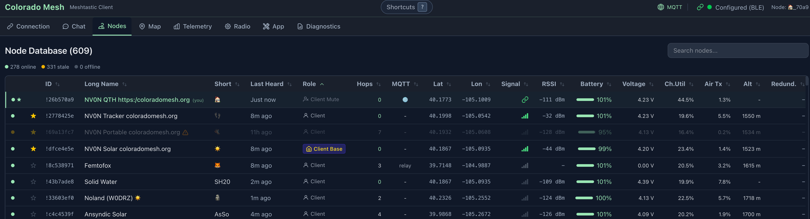

# Mesh-Client

> A cross-platform Meshtastic desktop client for **Mac**, **Linux**, and **Windows** — built for power users who need more than a mobile app.


---

## Why

The official Meshtastic apps cover the basics, but desktop power users need more: persistent message history, mesh diagnostics, MQTT integration, and keyboard-driven workflows. Mesh-Client fills that gap — a full-featured desktop client built on Electron with a local SQLite database, routing diagnostics, and multi-transport connectivity.

---

## Visuals

<details>
<summary>Screenshots</summary>

<table>
  <tr>
    <td></td>
    <td></td>
    <td></td>
    <td></td>
  </tr>
</table>

</details>

---

## Key Features

**Connectivity**

- **Bluetooth LE** — pair wirelessly; one-click reconnect card remembers your last device (name persists across sessions)
- **USB Serial** — plug in via USB; auto-reconnects silently on startup
- **WiFi/HTTP** — connect to network-enabled nodes; saves last address for quick reconnect
- **MQTT** — subscribe to a broker to receive mesh traffic over the internet; AES-128-CTR decryption, automatic RF deduplication, exponential-backoff reconnect

**Chat**

- Send/receive messages across channels with per-transport delivery badges (BT / USB / WiFi / MQTT) — shows ACK, no-ACK, and failure states independently for each transport
- Emoji reactions (11 emojis with compose picker) and reply-to-message (quoted preview in bubble)
- Unread message divider that persists across restarts and auto-scrolls on tab switch
- Direct messages (DMs) to individual nodes

**Node Management**

- Node list with SNR, battery, GPS, last heard, and packet redundancy score — **signal bars** (RSSI-based) appear **only for direct (0-hop) RF neighbors**; multi-hop and MQTT-only paths have no RSSI at the client, so bars are omitted there — **last heard** and **hops** stay accurate on BLE connect (replayed device-DB payloads no longer mark long-offline nodes as “just heard” or show stale hop counts; stale entries show **–** for hops where appropriate)
- Distance filter, favorite/pin nodes, device role icons, signal strength bars where direct RF applies
- Node Detail Modal: DM, trace route with hop-path display, delete node, Routing Health section with 24-hour sparkline, Connection Health %, and collapsible Path History

**Radio & Channel Configuration**

- Edit channels: name, PSK, and role; 18 region presets and 7 modem presets
- Device roles: Client, Router, Tracker, Sensor, TAK, and more
- Per-channel MQTT gateway uplink/downlink; device reboot, shutdown, and factory reset

**Diagnostics**

- **Network health** is **counts-first** — status band **Healthy / Attention / Degraded** plus error and warning counts and **nodes with telemetry** (aligned with node-list Ch.Util / Air Tx, not hop-map size). The old 0–100 score was removed — it stayed ~99 on large meshes and was misleading. **Degraded** (red) applies only when routing **error** count ≥ 3; fewer errors use **Attention** (orange) so small issues don’t paint the whole panel red.
- **Single table** from **diagnosticRows** (routing trace rows + RF rows), searchable; **connected node** (your device) section above mesh-wide rows. Rows persist across sessions with an optional **restore banner**; **max age** (1–168 hours) trims stale routing (24 h default) and RF (1 h default) rows.
- **Mesh congestion attribution** — orange banner when mesh-wide routing stress (e.g. bad_route / hop_goblin) is present; duplicate-traffic copy is scoped as observed at this client. Shared block component also appears in node detail when relevant.
- Routing anomaly detection: hop_goblin (distance-proven over-hopping only; SNR not used for multi-hop/MQTT), bad_route (high duplication without SNR gating), route_flapping, impossible_hop — with remediation suggestions and severity levels (error / warning / info). RF rows get a **Suggested Fix** column via RemediationEngine.
- Anomaly badges inline in node list; status aura circles on the map
- Congestion halos toggle; global and per-node MQTT ignore for fine-grained routing analysis
- **Environment Profile** segmented control — Standard (3 km), City (1.6× threshold for dense urban RF interference), Canyon (2.6× threshold for mountainous terrain)
- IP geolocation accuracy warning: when city-level fallback is active, thresholds are doubled automatically and a banner prompts for a more accurate position source

**Where diagnostics UI lives in code**

- **Node detail** (modal when you open a node): shell is [`src/renderer/components/NodeDetailModal.tsx`](src/renderer/components/NodeDetailModal.tsx); body content and RF findings list are [`src/renderer/components/NodeInfoBody.tsx`](src/renderer/components/NodeInfoBody.tsx) (`RFDiagnosticsSection`, mesh congestion / duplicate-traffic block, Connection Health / Path History when redundant paths exist). Modal body is scrollable (max height); position/trace/message actions are omitted for the home node.
- **Network diagnostics tab**: [`src/renderer/components/DiagnosticsPanel.tsx`](src/renderer/components/DiagnosticsPanel.tsx) (health band + counts, diagnosticRows table, mesh congestion banner, env profile, halo toggles, diagnostic row max age).
- **Mesh congestion UI**: [`src/renderer/components/MeshCongestionAttributionBlock.tsx`](src/renderer/components/MeshCongestionAttributionBlock.tsx) (shared between panel and node detail).
- **Engines**: RF findings [`src/renderer/lib/diagnostics/RFDiagnosticEngine.ts`](src/renderer/lib/diagnostics/RFDiagnosticEngine.ts); routing anomalies [`src/renderer/lib/diagnostics/RoutingDiagnosticEngine.ts`](src/renderer/lib/diagnostics/RoutingDiagnosticEngine.ts) (`computeHealthScore` remains for tests; panel no longer uses it as primary display); row merge/prune [`src/renderer/lib/diagnostics/diagnosticRows.ts`](src/renderer/lib/diagnostics/diagnosticRows.ts); store [`src/renderer/stores/diagnosticsStore.ts`](src/renderer/stores/diagnosticsStore.ts). There is no `NodeDetailPanel.tsx` in this repo—use the paths above if docs or tools refer to a “node detail panel.”

**Map & Telemetry**

- Interactive OpenStreetMap with node positions and your current location
  (device GPS → browser geolocation → IP-based city-level fallback)
  — auto-refresh at configurable intervals; manual static position entry; send your position back to your device
- Battery voltage and signal quality charts (Recharts)

**Productivity**

- **Log panel** (right rail) — live app log stream from the main process, optional debug logging toggle, export or delete the log file
- Full keyboard navigation — press `?` for shortcut reference; `Cmd/Ctrl+1–8` switches tabs; `Cmd/Ctrl+F` searches chat
- Automatic update checking — packaged builds download and install in-app; macOS opens the release page
- System tray with live unread badge; app stays accessible when window is closed
- Persistent storage via local SQLite; DB export/import/clear in the App tab; Clear GPS Data and Reset Diagnostics actions available without a full DB wipe

---

## Quick Start

**Prerequisites:**

- Node.js 22.12.0+ (matches `@electron/rebuild` / `node-abi` engine requirement) and npm 9+
- Native build tools (for SQLite) — see platform notes below
- A Meshtastic device (any hardware running Meshtastic firmware)

### Mac & Linux

```bash
git clone https://github.com/Colorado-Mesh/meshtastic-client
cd meshtastic-client
npm install
npm start
```

<details>
<summary>Mac — extra notes</summary>

Install Xcode Command Line Tools if `npm install` fails:

```bash
xcode-select --install
```

On first Bluetooth connection, macOS shows a system popup requesting Bluetooth permission — you must accept. If you accidentally denied it, go to **System Settings > Privacy & Security > Bluetooth** and toggle Mesh-Client on.

</details>

<details>
<summary>Linux — extra notes</summary>

Install Node.js (22.12.0+ recommended) and build tools:

```bash
# Debian/Ubuntu — install nvm, then Node 22 LTS:
curl -fsSL https://raw.githubusercontent.com/nvm-sh/nvm/v0.40.0/install.sh | bash
export NVM_DIR="$HOME/.nvm"
[ -s "$NVM_DIR/nvm.sh" ] && . "$NVM_DIR/nvm.sh"
nvm install 22

# Build tools for native modules:
sudo apt install build-essential python3

# Fedora/RedHat — Node 22 via nvm, then dev tools:
curl -fsSL https://raw.githubusercontent.com/nvm-sh/nvm/v0.40.0/install.sh | bash
export NVM_DIR="$HOME/.nvm"
[ -s "$NVM_DIR/nvm.sh" ] && . "$NVM_DIR/nvm.sh"
nvm install 22
sudo dnf groupinstall "Development Tools" && sudo dnf install python3
```

**Building distributables:**

On Debian/Ubuntu, to also build `.rpm` packages you need the `rpm` package:

```bash
sudo apt install rpm
```

On Fedora/RedHat, building `.deb` packages is not easily supported. Use these targets instead:

```bash
npm run dist:linux -- --linux rpm
npm run dist:linux -- --linux appimage
```

BLE requires BlueZ (the standard Linux Bluetooth stack, included in most distros).

**Sandbox issues (dev mode or AppImage):**

Some Linux configurations require disabling Electron's sandbox. If the app fails to launch, try:

```bash
npm run dev -- --no-sandbox        # dev mode
./MeshClient.AppImage --no-sandbox # AppImage
```

For serial access, add yourself to the `dialout` group (then log out and back in):

```bash
sudo usermod -a -G dialout $USER
```

**ARM architecture (Raspberry Pi, etc.) — additional requirements:**

Install these extra libraries before running in development mode:

```bash
sudo apt install zlib1g-dev libfuse2
```

Electron's sandbox requires elevated privileges on ARM. Either grant sandbox permissions:

```bash
sudo sysctl -w kernel.unprivileged_userns_clone=1
```

Or launch with the no-sandbox flag:

```bash
npm run dev -- --no-sandbox
# or
electron . --no-sandbox
```

**SIGILL during `npm install`** (`electron exited with signal SIGILL`):

`postinstall` runs `scripts/rebuild-native.mjs`, which invokes electron-builder’s `install-app-deps` — that **executes** the Electron binary. Sandboxed or minimal-CPU environments may not support instructions in the prebuilt Linux binary, so the process dies with SIGILL before the app starts (this is not the same as Chromium’s `--no-sandbox` runtime flag).

If you see `npm WARN EBADENGINE` for `@electron/rebuild` or `node-abi` (for example `required: { node: '>=22.12.0' }` while your current Node is older), install Node 22+ first (for example via nvm as shown above). Running with an older Node version may appear to work but is unsupported by those tools and more likely to fail during native rebuilds.

```bash
# Install without running Electron / native rebuild; patch-package still runs.
MESHTASTIC_SKIP_ELECTRON_REBUILD=1 npm install
```

Then run **`npm run rebuild`** on a normal Linux machine (or same host outside the sandbox) where `node_modules/electron/dist/electron --version` works. Lint/tests that do not load the Electron main process may still pass without a successful rebuild.

**SIGSEGV on startup** (`electron exited with signal SIGSEGV`):

`npm start` runs `npm run build && electron .` — extra args after `npm start --` are **not** passed to Electron. Use one of:

```bash
npm run build && npx electron . --no-sandbox --disable-gpu
# or (after build once)
npm run electron:open -- --no-sandbox --disable-gpu
```

If that works, make it persistent:

- **Shell:** `export MESH_CLIENT_DISABLE_GPU=1` then `npm start` (main process disables GPU before windows open).
- **Wayland → X11:** `ELECTRON_OZONE_PLATFORM_HINT=x11 npm run electron:open -- --no-sandbox`
- **Packaged AppImage:** `./MeshClient.AppImage --no-sandbox --disable-gpu`

See [electron#41980](https://github.com/electron/electron/issues/41980) and related GPU/Wayland issues.

</details>

<details>
<summary>Windows — extra notes</summary>

**1. Install prerequisites** (if not already):

```powershell
winget install git.git
winget install openjs.nodejs
```

**2. Allow npm scripts:**

```powershell
Set-ExecutionPolicy -ExecutionPolicy RemoteSigned -Scope CurrentUser
```

**3. Install [Visual Studio Build Tools](https://visualstudio.microsoft.com/visual-cpp-build-tools/)** with the "Desktop development with C++" workload (required for native SQLite).

**4. Clone and run:**

```bash
git clone https://github.com/Colorado-Mesh/meshtastic-client
cd meshtastic-client
npm install
npm start
```

If serial isn't detected, install the correct USB drivers for your device (CP210x or CH340).

</details>

---

## Usage

### Connecting Your Device

1. Power on your Meshtastic device
2. Put it in Bluetooth pairing mode (if connecting via BLE)
3. Open Mesh-Client and go to the **Connection** tab
4. Select your connection type (Bluetooth / USB Serial / WiFi / MQTT)
5. Click **Connect** and select your device from the picker
6. Wait for status to show **Configured** — you're connected

### Auto-Reconnect

After a successful connection, Mesh-Client remembers your last device. On next launch:

- **Serial** — auto-connects silently in the background
- **Bluetooth / WiFi** — a one-click reconnect card appears; click **Reconnect** (BLE requires a user gesture)
- **MQTT** — auto-reconnects using saved broker settings

### MQTT

Enter your broker URL, topic, and optional credentials in the MQTT section of the Connection tab. When connected, the section collapses to a compact info card showing the server, client ID, and topic. You can send messages via MQTT even when no hardware device is connected.

---

## Configuration

### Connection Types

| Platform | Bluetooth | Serial | HTTP | MQTT |
| -------- | --------- | ------ | ---- | ---- |
| macOS    | Yes       | Yes    | Yes  | Yes  |
| Windows  | Yes       | Yes    | Yes  | Yes  |
| Linux    | Yes       | Yes    | Yes  | Yes  |

### Tech Stack

| Component  | Technology                        |
| ---------- | --------------------------------- |
| Desktop    | Electron                          |
| UI         | React 19 + TypeScript             |
| Styling    | Tailwind CSS v4                   |
| Meshtastic | @meshtastic/core (JSR)            |
| Maps       | Leaflet + OpenStreetMap           |
| Charts     | Recharts                          |
| Database   | SQLite (better-sqlite3)           |
| Build      | esbuild + Vite + electron-builder |

### Project Structure

```
meshtastic-client/
├── src/
│   ├── main/
│   │   ├── index.ts              # Window creation, BLE/Serial intercept, all IPC handlers
│   │   ├── log-service.ts        # Log file, console patch, log panel IPC
│   │   ├── database.ts           # SQLite schema & migrations (WAL mode, user_version 9)
│   │   ├── mqtt-manager.ts       # MQTT client: AES decrypt, dedup, protobuf decode
│   │   ├── updater.ts            # Auto-update checks via electron-updater
│   │   └── gps.ts                # Main-process GPS helper
│   ├── preload/
│   │   └── index.ts              # contextBridge: electronAPI (db, mqtt, log, BLE, serial, session)
│   └── renderer/
│       ├── App.tsx               # Shell: 8 tabs, Log panel (right rail), keyboard shortcuts, status header
│       ├── main.tsx              # React entry point
│       ├── components/
│       │   ├── ChatPanel.tsx         # Chat UI, DMs, emoji reactions, channel switching
│       │   ├── NodeListPanel.tsx     # Node browser with online/stale/offline/MQTT filter
│       │   ├── MapPanel.tsx          # Node positions on OpenStreetMap (Leaflet)
│       │   ├── TelemetryPanel.tsx    # Battery/voltage/SNR charts (Recharts)
│       │   ├── AdminPanel.tsx        # Reboot, shutdown, factory reset, trace route
│       │   ├── ConfigPanel.tsx       # Device & channel configuration editor
│       │   ├── ConnectionPanel.tsx   # BLE/Serial/HTTP/MQTT connection setup
│       │   ├── DiagnosticsPanel.tsx  # Health band + counts, diagnosticRows table, halos, max age
│       │   ├── MeshCongestionAttributionBlock.tsx  # Shared mesh congestion / duplicate-traffic copy
│       │   ├── LogPanel.tsx          # Live app log, debug toggle, export/delete log file
│       │   ├── RadioPanel.tsx        # Radio settings, fixed position, GPS send
│       │   ├── AppPanel.tsx          # App settings, appearance (theme presets), GPS interval, database management
│       │   ├── NodeDetailModal.tsx   # Detailed node info overlay
│       │   ├── NodeInfoBody.tsx      # Shared node info content (modal + map popup)
│       │   ├── KeyboardShortcutsModal.tsx
│       │   ├── UpdateBanner.tsx      # In-app update notification
│       │   ├── ErrorBoundary.tsx     # Top-level React error boundary
│       │   ├── SignalBars.tsx        # RSSI→bars for direct (0-hop) RF only; null rssi → no bars
│       │   ├── RefreshButton.tsx
│       │   ├── Toast.tsx
│       │   └── Tabs.tsx
│       ├── hooks/
│       │   └── useDevice.ts          # Core hook: device lifecycle, 3 transports, auto-reconnect
│       ├── stores/
│       │   ├── diagnosticsStore.ts   # Zustand: anomalies, packet stats, halo flags, MQTT ignore
│       │   └── mapViewportStore.ts   # Zustand: persisted map center/zoom
│       └── lib/
│           ├── types.ts              # TypeScript interfaces: MeshNode, ChatMessage, DeviceState…
│           ├── connection.ts         # Connection factory: BLE/Serial/HTTP transport creation
│           ├── gpsSource.ts          # GPS waterfall: device coords → browser geolocation → null
│           ├── nodeStatus.ts         # Node freshness: online <30 min, stale <2 h, offline 2 h+
│           ├── coordUtils.ts         # Coordinate conversion helpers
│           ├── reactions.ts          # Emoji reaction helpers
│           ├── roleInfo.tsx          # Node role display metadata
│           ├── signal.ts             # RSSI → signal level for SignalBars (direct RF only)
│           ├── parseStoredJson.ts    # Safe JSON parse for persisted values
│           └── diagnostics/
│               ├── RoutingDiagnosticEngine.ts  # Hop anomaly detectors (hop_goblin, bad_route, etc.)
│               ├── RFDiagnosticEngine.ts        # RF-layer signal diagnostics (CU spike, hidden terminal, etc.)
│               ├── diagnosticRows.ts            # Row merge/prune, routing map helper, default ages
│               ├── meshCongestionAttribution.ts # Path mix + RF originator ranking for congestion copy
│               └── RemediationEngine.ts         # Suggested fixes for routing + RF rows
├── resources/
│   ├── icons/                    # App icons (linux/, mac/, win/)
│   ├── entitlements.mac.plist    # macOS signing entitlements (main)
│   └── entitlements.mac.inherit.plist  # macOS child-process entitlements
├── scripts/
│   ├── rebuild-native.mjs        # Rebuilds better-sqlite3 for Electron ABI (postinstall); removes stale build/ first to avoid wrong-platform .node after copying node_modules across OSes
│   └── wait-for-dev.mjs          # Waits for Vite dev server before launching Electron
├── docs/
│   ├── accessibility-checklist.md
│   └── images/                   # README screenshots (node-list, map, diagnostics, node-detail)
├── electron-builder.yml          # Distributable config (targets, icons, signing)
├── vite.config.ts                # Renderer build (Vite)
├── vitest.config.ts              # Test runner config
├── tsconfig.json                 # Base TypeScript config (renderer)
├── tsconfig.main.json            # TypeScript config for main/preload
└── package.json
```

---

## Building a Distributable

```bash
npm run dist:mac      # macOS → .dmg + .zip in release/
npm run dist:linux    # Linux → .AppImage + .deb in release/
npm run dist:win      # Windows → .exe installer in release/
```

Output goes to the `release/` directory.

---

## Contributing / Development

To run in development mode with hot reload:

```bash
npm run dev
```

This starts the Vite dev server, watches main/preload for changes, and launches Electron automatically. For the best experience, install [React DevTools](https://react.dev/link/react-devtools).

CI (GitHub Actions) runs on **Node 22** for build, test, and release jobs. Use Node 22 locally to match CI and avoid Linux-specific issues on older Node versions. To run workflows locally, use [act](https://github.com/nektos/act) with the amd64 image so Linux jobs match the runner environment:

```bash
act --container-architecture linux/amd64
```

Under act, artifact upload is skipped automatically; the rest of the pipeline runs as on GitHub.

The pre-commit hook runs format, lint, typecheck, and tests. See [CONTRIBUTING.md](CONTRIBUTING.md) for coding conventions, branch workflow, and PR guidelines.

---

## Community

Join the `#mesh-client-development` channel on Discord for help, feedback, and development discussion: https://discord.com/invite/McChKR5NpS

---

## Troubleshooting

### `npm install` fails on native module compilation

You're missing build tools for the native SQLite module:

- **Mac**: `xcode-select --install`
- **Linux**: `sudo apt install build-essential python3`
- **Windows**: Install [Visual Studio Build Tools](https://visualstudio.microsoft.com/visual-cpp-build-tools/) with the "Desktop development with C++" workload

### BLE connection fails with "Connection attempt failed"

- Make sure your device has Bluetooth enabled and is in pairing mode
- On macOS: check **System Settings > Privacy & Security > Bluetooth**
- Try disconnecting fully first, then reconnecting
- If the device picker never appears, restart the app

### Serial port not detected

- Ensure USB drivers are installed for your device (CP210x, CH340, etc.)
- On Linux, add yourself to the `dialout` group: `sudo usermod -a -G dialout $USER`

### App crashes on launch (macOS distributable)

- **macOS 26 (Tahoe) + EXC_BREAKPOINT at launch**: electron-builder ad-hoc signing can crash during ElectronMain/V8 init before any app code runs. This repo sets `mac.identity: null` in `electron-builder.yml` so the packaged app is unsigned and avoids that re-sign path; first open may require **Right-click → Open** or `xattr -cr` on the app. For notarized releases, set a real Developer ID in `mac.identity` and retest on macOS 26. See [electron#49522](https://github.com/electron/electron/issues/49522) and [electron-builder#9396](https://github.com/electron-userland/electron-builder/issues/9396).
- This may also be a native module signing issue — try rebuilding: `npm run dist:mac`
- If building from source: make sure `npm install` completed without errors

### App shows "disconnected" but device is still on

- The Bluetooth connection can drop silently — click Disconnect, then Connect again
- For serial: the USB cable may have been bumped — reconnect

### Permission messages in the console

`[permissions] checkHandler: media → denied` and `web-app-installation → denied` are expected. The app only uses **serial** and **geolocation** — media and web-app-installation are intentionally denied.

### `npm run dist:mac` fails with `GH_TOKEN` / "Cannot cleanup"

electron-builder publishes to GitHub when it thinks it’s in CI. Local builds use `--publish never` so artifacts land in `release/` without a token. Tag releases use `npm run dist:mac:publish` (and `:linux:publish` / `:win:publish`) with `GH_TOKEN` set — see `.github/workflows/release.yaml`.

### `[DEP0190]` when running electron-builder

Node deprecates `spawn(..., { shell: true })` with an args array. This project patches `app-builder-lib` via `patch-package` so macOS/Linux use `shell: false` for the npm dependency collector. Re-run `npm install` if you upgrade electron-builder and the warning returns.

### `duplicate dependency references` during dist

npm’s JSON tree lists hoisted packages with many duplicate refs (one per edge). That’s expected and not something you need to fix. The **app-builder-lib** patch logs that summary at **debug** only so normal `dist:*` runs stay quiet. To see it: `DEBUG=electron-builder npx electron-builder --mac` (or your usual dist command).

### `[DEP0169]` / `url.parse()` deprecation warning

The app uses npm package overrides to force `follow-redirects` and `cacheable-request` onto versions that use the WHATWG URL API, which removes this warning. To trace the source of any deprecation, run:

```bash
npm run trace-deprecation
```

### "A native module failed to load" dialog on startup

**Cause**: `better-sqlite3` was compiled for a different Electron ABI — common after an Electron or Node version change.

**Fix**: Run `npm install` (the postinstall script rebuilds native modules for the correct ABI automatically). The rebuild step **removes any existing `node_modules/better-sqlite3/build`** before compiling, so a wrong-platform `.node` (e.g. Linux ELF left on macOS after copying `node_modules`) cannot persist and cause `ERR_DLOPEN_FAILED`.

- If you still see dlopen errors after switching machines or OSes, delete `node_modules` and run a clean `npm install`.
- **Windows**: Also ensure the [Visual C++ Redistributable](https://learn.microsoft.com/en-us/cpp/windows/latest-supported-vc-redist) is installed.

### `dist:win` fails: "space in the path" or `EPERM` unlink on `better_sqlite3.node`

**Symptoms**

- `Attempting to build a module with a space in the path` during `npm run dist:win` (or `npm run rebuild`).
- `EPERM: operation not permitted, unlink '...\better-sqlite3\build\Release\better_sqlite3.node'`.

**Cause**

1. **Spaces in the project path** — node-gyp and the native rebuild step are unreliable when the repo lives under a path with spaces (e.g. `C:\Users\Joey Stanford\meshtastic-client`). See [node-gyp#65](https://github.com/nodejs/node-gyp/issues/65#issuecomment-368820565).
2. **EPERM on unlink** — Something on Windows still has the `.node` file open (another `node`/`electron` process, antivirus/Windows Defender scanning the file, or a stuck handle), so the rebuild cannot replace it.

3. **Why it used to work** — electron-builder **always runs a second native rebuild** during `dist:win` (after `postinstall` already built `better-sqlite3`). Recent **@electron/rebuild** / node-gyp behavior can hit EPERM when replacing the existing `.node`. The repo now runs a **beforeBuild** hook that deletes `node_modules/better-sqlite3/build` first (with retries) so the packaging rebuild compiles into a clean folder instead of unlinking a locked file. If delete still hits EPERM, the hook **renames** `build` to `build.stale.<timestamp>` (so node-gyp can create a fresh `build`) or tries **`rd /s /q`** before failing.

**Fix**

1. **Try a normal dist again** — `npm run dist:win`. The **beforeBuild** hook removes `better-sqlite3/build` before electron-builder’s rebuild so node-gyp often avoids EPERM unlink.
2. **Skip the packaging rebuild** — If `npm install` / `npm run rebuild` already produced a good `better_sqlite3.node` for this Electron version:

   ```bash
   npm run dist:win:skip-rebuild
   ```

   Use when EPERM persists or you only build **x64 on an x64 machine**. Building **arm64** on an x64 host still needs a successful rebuild for that arch.

3. **Use a path without spaces** (strongly recommended):
   - Clone or copy the repo to e.g. `C:\dev\meshtastic-client` or `C:\src\meshtastic-client`, then `npm install` and `npm run dist:win` from there.
   - Alternatively, use a directory junction so the “short” path is what tools see, e.g. `mklink /J C:\dev\mesh C:\Users\YourName\meshtastic-client` and work from `C:\dev\mesh`.
4. **Clear the lock before rebuild**:
   - Quit any running Mesh-client/Electron dev instances and close other terminals that might be using the repo.
   - Manually delete `node_modules\better-sqlite3\build` (whole folder). If delete fails, something is still holding the file — use Task Manager to end stray `node.exe` / `electron.exe`, then retry.
   - Optionally add the project folder to Windows Defender exclusions temporarily while building.
5. **Rebuild then dist**:
   - From the no-space path: `npm run rebuild` — if that succeeds, run `npm run dist:win`.

CI builds avoid both issues by using short paths and clean agents; local Windows builds need the same constraints.

### Database directory is not writable

**Error**: `"Database directory is not writable: <path>"`

**Cause**: File permissions on the app's `userData` directory are too restrictive.

**Fix**:

- **Mac/Linux**: `chmod 755 ~/Library/Application\ Support/mesh-client` (or `~/.config/mesh-client` on Linux)
- **Windows**: Right-click `%APPDATA%\mesh-client` → Properties → Security → grant your user Full Control

### MQTT: "Connection lost after N reconnect attempts"

**Cause**: Broker unreachable, bad credentials, or wrong port.

**Fix**: Verify the broker URL, port (default 1883, or 8883 for TLS), and username/password. Check that your firewall allows outbound connections on the broker port.

### MQTT: "Subscribe failed"

**Cause**: Topic permission denied on the broker, or wildcards not allowed by the broker ACL.

**Fix**: Confirm the broker's ACL allows your client to subscribe to the configured topic prefix.

### BLE auto-reconnect: "No previously connected BLE device found"

**Cause**: The reconnect card appeared, but the browser lost the cached device handle — for example, the app was fully quit and relaunched.

**Fix**: Click **Forget this device** on the reconnect card and pair fresh using the Bluetooth picker.

### GPS "Location unavailable" or stuck on the map

**Cause**: Browser geolocation was denied, or the device has no GPS fix yet.

**Fix**:

- Grant location permission when prompted by the app.
- Or set coordinates manually via the **Radio** tab → Fixed Position.
- Note: The IP-geolocation fallback (ip-api.com, then ipwho.is) provides city-level accuracy only — not suitable for position broadcasting. If both services are unreachable, "Location unavailable" is shown.

### "Something went wrong" blank screen

**Cause**: An unhandled React render error, usually from a corrupt or unexpected database value.

**Fix**: Open the **App** tab → **Clear Database**, then restart. If the window never loads at all, delete the SQLite file manually:

- **Mac**: `~/Library/Application Support/mesh-client/`
- **Windows**: `%APPDATA%\mesh-client\`
- **Linux**: `~/.config/mesh-client/`

### macOS: "representedObject is not a WeakPtrToElectronMenuModelAsNSObject" when typing in chat

**Cause**: Known Electron/Chromium quirk on macOS when the first responder is a text field (e.g. the chat input). The native menu bridge logs this; it does not affect behavior.

**Fix**: None required — safe to ignore. Copy/paste and other edit actions still work.

### Update check fails / no update banner

The app functions fully offline — this is not a critical error. If "Update check failed" appears in the console, verify network connectivity. Update checks are rate-limited by the GitHub API and may silently skip when the limit is reached.

### Diagnostics panel: "restored from last session" banner

**Cause**: Diagnostic rows (routing + RF) are snapshotted to `localStorage` so a restart doesn’t wipe the table.

**Fix**: This is expected — rows refresh as new packets arrive. Use **Stop restoring on next launch** on the banner to clear the snapshot, or use **App** tab → **Reset Diagnostics** to clear in-memory rows and related state.

### Diagnostics look stale or overcrowded

**Cause**: RF rows age out faster (default 1 h) than routing rows (default 24 h); very old rows are pruned by timestamp.

**Fix**: In **Network Diagnostics** → Display Settings, adjust **diagnostic row max age** (hours). Or reset diagnostics from the App tab and let the mesh repopulate.

### No signal bars on some nodes

**Cause**: RSSI is only meaningful for **direct (0-hop) RF** neighbors. Multi-hop and MQTT-heard nodes have no client-side RSSI.

**Fix**: Not a bug — use SNR/last heard and routing diagnostics instead for those paths.

---

## License

MIT — see [LICENSE](LICENSE)

## Credits

See [CREDITS.md](CREDITS.md). Created by **[Joey (NV0N)](https://github.com/rinchen)** & **[dude.eth](https://github.com/defidude)**. Based on the [original Mac client](https://github.com/Colorado-Mesh/meshtastic_mac_client). Part of **[Colorado Mesh](https://github.com/Colorado-Mesh/meshtastic-client)**.
